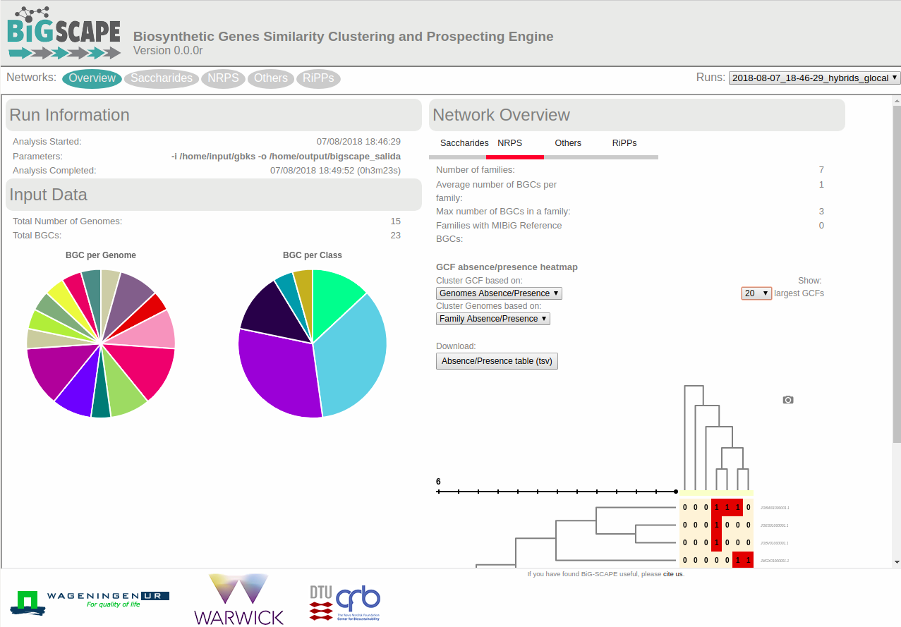

# BiG-SCAPE / CORASON tutorial

This tutorial explains how to download datasets to run BiG-SCAPE and CORASON, and provides examples for how to use both tools.

## Input dataset  

### Example dataset

The example dataset consists on three parts: a set of genomes (includes a single cluster from MIBiG), a set of GenBank files (selected clusters predicted from the set of genomes) and the TauD sequence from a *Streptomyces* genome (NRRL B-1347).

Download and execute the following script to obtain the files:

```bash
$ mkdir ~/bin/example    # not required if you already have that
$ curl https://raw.githubusercontent.com/nselem/bigscape-corason/master/scripts/data_bigscape_corason.sh> ~/bin/example/data_bigscape_corason.sh
$ chmod a+x ~/bin/example/data_bigscape_corason.sh
$ cd ~/bin/example && ~/bin/example/data_bigscape_corason.sh
```

Data can also be downloaded manually at: 
[](https://doi.org/10.5281/zenodo.1340706)

### How to compile your own input dataset

In this tutorial, we will work with the above example data. If you want to use your own gene clusters as input for BiG-SCAPE and the CORASON family mode integrated within the BiG-SCAPE pipeline, you can search for publicly available genomes in [antiSMASH-DB](https://antismash-db.secondarymetabolites.org/#!/start) and download the desired cluster files in GenBank (.gbk) format. Alternatively, you can perform your own antiSMASH runs on the public [web server](https://antismash.secondarymetabolites.org/#!/start) or on your local system, collect the cluster GBK files and put them together in a folder that you can use as input for BiG-SCAPE. Entries from MIBiG can be added automatically by adding the `--mibig` flag to the end of your BiG-SCAPE command (see below).  

## BiG-SCAPE example

We will now proceed with the example data. Once data has been downloaded, run the following command at the terminal (you should be now in the `~/bin/example` folder):

```bash
$ run_bigscape gbks example_output
```

If everything goes well, the terminal will show something similar to:


 
The _input_ for BiG-SCAPE is the directory _gbks_ that contains GenBank files of sequences of Biosynthetical gene clusters (BGCs) predicted by antiSMASH. The BiG-SCAPE _output_ will be stored in the directory `example_output`.

After BiG-SCAPE has finished successfully open the `index.html` file located inside the `example_output` folder with your browser, (e.g. Chrome or Firefox). The file contains an interactive offline webpage that displays the BiG-SCAPE results and allows you to explore them.



To start exploring, select a class at the top of the site:  
  
 
Now, the screen will display a network visualization of BGC families within this class.  
  

In this case, the NRPS class contains 10 BGCs organized in one gene cluster family of three members, one family of two members and five singletons.  

Now select a family in this network to visualize BGCs sorted and aligned by CORASON.  
  
 This family contains three members.  


BiG-SCAPE output is also compatible with Cytoscape visualization.  


In another example BiG-SCAPE was employed to calculate BGC familiess in 103 complete Streptomyces genomes. The outcome of this run can be found [here](http://bioinformatics.nl/~xnava009/streptomyces_out/)  


## CORASON example 

## Corason example  
`run_corason -g gbks -q TauD.faa -s BGC0000715.1.cluster001.gbk`    
