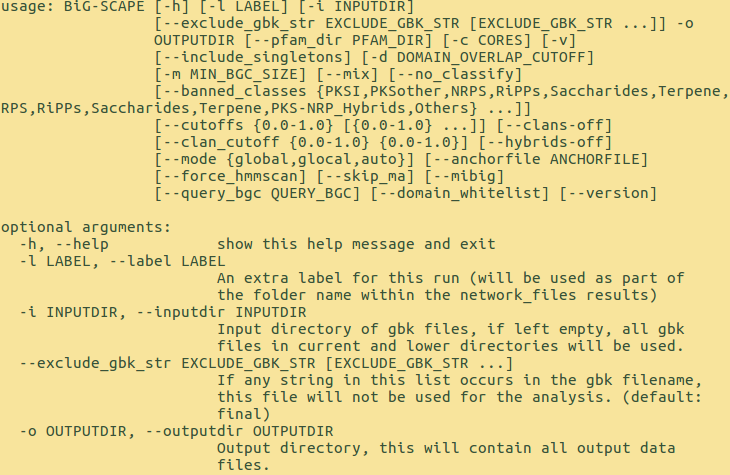

# Installation

The following instructions cover [Docker](https://www.docker.com/) installation of both pipelines: [BiG-SCAPE](#big-scape-installation) and [CORASON](#corason-installation). BiG-SCAPE can also be installed manually or within a virtual environment. Docker is a container platform provider available for multiple operative systems such as Mac OS X, Windows 10 and Linux (Fedora, Ubuntu, Centos and Debian). To install Docker consult [here](dockerInstall.md).
The installation procedure uses `curl`. See [here](curlInstallation.md) if you don't have it.

## BiG-SCAPE installation

At the moment, there are two methods available to run BiG-SCAPE:

- Using the pre-built Docker image, a slightly larger download but zero-fuss install on any system that can run Docker.
- Installing all the dependencies (using a virtual environment is recommended).

### Installation using Docker

```bash
$ mkdir ~/bin    # not required if you already have that
$ curl -q https://git.wageningenur.nl/medema-group/BiG-SCAPE/raw/master/run_bigscape > ~/bin/run_bigscape
$ chmod a+x ~/bin/run_bigscape
$ ~/bin/run_bigscape
```

If BiG-SCAPE is correctly installed the terminal displays the help menu after some seconds:


### Manual installation  

#### Requirements

* Python (Python 3.x. compatibility with Python 2 is not guaranteed)
* The [HMMER](http://hmmer.org/) suite, version 3.2 (or any version compatible with Pfam)
* The (processed) Pfam database. For this, download the latest `Pfam-A.hmm.gz`
file from the [Pfam website](ftp://ftp.ebi.ac.uk/pub/databases/Pfam/releases/), uncompress it and process it using the `hmmpress` command.
* Biopython
* Numpy
* scipy
* scikit-learn
* NetworkX

#### Installing dependencies using Conda

Although each library can be installed individually, the use of a virtual environment is highly recommended. Here is a quick guide for BiG-SCAPE installation using Miniconda (downloading the Pfam library manually is still necessary):

* Install [Miniconda](https://conda.io/miniconda.html). We recommend that you install the Python 3 version as default for all new conda environments. You will need to login again for the changes to go into effect. You can download Miniconda as follows:

```bash
$ wget https://repo.continuum.io/miniconda/Miniconda3-latest-Linux-x86_64.sh
$ bash Miniconda3-latest-Linux-x86_64.sh
```

* Create a new environment. You can choose Python 3 using `python=3` at the end of the next command even if you installed the Python 2 version of Miniconda (see additional documentation of the conda environment [here](https://conda.io/docs/)).

```bash
$ conda create --name bigscape
```

* Activate new environment:

```bash
$ source activate bigscape
```

* Install packages:

```bash
$ conda install numpy scipy scikit-learn
$ conda install -c bioconda hmmer biopython fasttree
$ conda install -c anaconda networkx
```

Once the environment is ready (or the packages installed) download or clone the code from the repository and run as

```bash
$ python bigscape.py [parameters]
```

[(see here for an overview of the options)](https://git.wageningenur.nl/medema-group/BiG-SCAPE/wikis/parameters)


## Corason installation

### Docker installation

```bash
$ mkdir ~/bin    # not required if you already have that
$ curl -q https://github.com/nselem/corason/blob/master/run_corason > ~/bin/run_corason
$ chmod a+x ~/bin/run_corason
```

----------------
